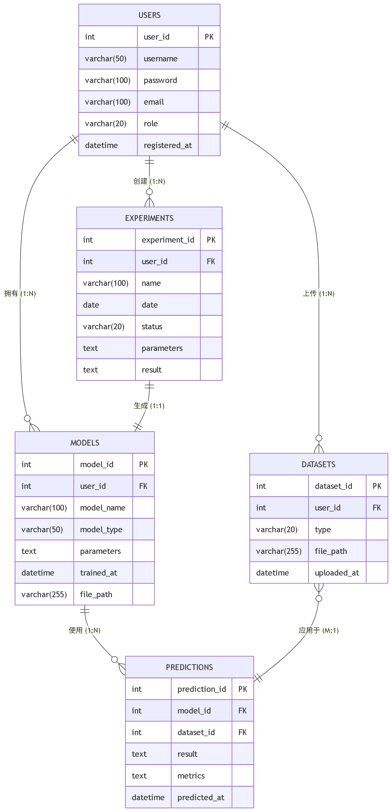

# 开发环境配置、数据库E-R设计及实现

## 一. 开发工具选择
- **前端**: Vue
- **数据库**: MySQL
- **ORM**: SQLModel
- **模型**: 西瓜书上提到的机器学习算法与标准深度学习框架（暂定提供代码框架 ）
- **任务队列(可选)**: Celery + Redis（如果做异步）
- **模型输入界面**: FastAPI

## 二. 数据库表与关系结构设计
### E-R图

 
### 表格1 - Users
| 字段名 | 类型 | 说明 | 约束                                   |
|--------|------|------|--------------------------------------|
| user_id | INT（主键） | 用户ID，自增 | PRIMARY KEY, AUTO_INCREMENT, NOT NULL |
| username | VARCHAR(50) | 用户名 | NOT NULL                             |
| password | VARCHAR(100) | 密码（加密存储） | NOT NULL                             |
| email | VARCHAR(100) | 邮箱 | NOT NULL, UNIQUE                     |
| role | VARCHAR(20) | 用户角色（admin/user） | NOT NULL |
| registered_at | DATETIME | 注册时间 | DEFAULT CURRENT_TIMESTAMP |

**说明**：用户信息表，存储系统所有注册用户的基本信息，包括管理员与用户

### 表格2 - Experiments
| 字段名 | 类型 | 说明 | 约束 |
|--------|------|------|------|
| experiment_id | INT | 实验ID | PRIMARY KEY, AUTO_INCREMENT, NOT NULL |
| user_id | INT | 关联用户 | NOT NULL, FOREIGN KEY REFERENCES users(user_id) ON DELETE CASCADE |
| name | VARCHAR(100) | 实验名称 | NOT NULL |
| date | DATE | 实验日期 | NOT NULL |
| status | VARCHAR(20) | 状态（完成/训练中/失败） | NOT NULL, CHECK(status IN ('completed','training','failed')) |
| parameters | TEXT | 模型参数 | NULL |
| result | TEXT | 模型结果（摘要信息） | NULL |

**说明**：记录用户创建的机器学习实验信息

### 表格3 - Datasets
| 字段名 | 类型 | 说明 | 约束 |
|--------|------|------|------|
| dataset_id | INT | 数据集ID | PRIMARY KEY, AUTO_INCREMENT, NOT NULL |
| user_id | INT | 上传者 | NOT NULL, FOREIGN KEY REFERENCES users(user_id) ON DELETE CASCADE |
| type | VARCHAR(20) | 类型（train/test） | NOT NULL, CHECK(type IN ('train','test')) |
| file_path | VARCHAR(255) | 文件路径或链接 | NOT NULL |
| uploaded_at | DATETIME | 上传时间 | DEFAULT CURRENT_TIMESTAMP |

**说明**：记录用户上传的训练/测试数据集信息

### 表格4 - Models
| 字段名 | 类型 | 说明 | 约束 |
|--------|------|------|------|
| model_id | INT | 模型ID | PRIMARY KEY, AUTO_INCREMENT, NOT NULL |
| user_id | INT | 所属用户 | NOT NULL, FOREIGN KEY REFERENCES users(user_id) ON DELETE CASCADE |
| model_name | VARCHAR(100) | 模型名称 | NOT NULL |
| model_type | VARCHAR(50) | 模型类型（如SVM、ResNet等） | NOT NULL |
| parameters | TEXT | 参数设置 | NULL |
| trained_at | DATETIME | 训练时间 | DEFAULT CURRENT_TIMESTAMP |
| file_path | VARCHAR(255) | 模型保存路径 | NOT NULL |

**说明**：记录训练完成的模型元数据信息

### 表格5 - Predictions
| 字段名 | 类型 | 说明 | 约束 |
|--------|------|------|------|
| prediction_id | INT | 预测ID | PRIMARY KEY, AUTO_INCREMENT, NOT NULL |
| model_id | INT | 使用的模型 | NOT NULL, FOREIGN KEY REFERENCES models(model_id) ON DELETE CASCADE |
| dataset_id | INT | 使用的数据集 | NOT NULL, FOREIGN KEY REFERENCES datasets(dataset_id) ON DELETE CASCADE |
| result | TEXT | 预测结果（可为JSON） | NULL |
| metrics | TEXT | 评估指标（如准确率） | NULL |
| predicted_at | DATETIME | 预测时间 | DEFAULT CURRENT_TIMESTAMP |

**说明**：记录模型在数据集上的预测结果和评估指标

### 关系说明
- **User与Experiment**: 1对N（一个用户可以创建多个实验）
- **User与Dataset**: 1对N（一个用户可以上传多个数据集）
- **User与Model**: 1对N（一个用户可以训练多个模型）
- **Experiment与Model**: 1对1（一个实验对应一个模型，一个模型属于一个实验）
- **Model与Prediction**: 1对N（一个模型可以进行多次预测）
- **Dataset与Prediction**: M对N（一个数据集可以用于多个预测，一个预测可以使用多个数据集）

## 三. 数据库实现

### 1.数据库与表的建立

1. **建立课程设计专用数据库homework**  
2. **按照上述设计建立表格**  
3. **保存为create_tables.sql**  
4. **构建检查所有表状态的check_all_tables.sql**

### 2.索引设计

1. **用户表索引**
- username, email, role 分别作为  
- idx_users_username, idx_users_email, idx_users_role

2. **实验表索引**
- user_id, status, date 分别作为  
- idx_experiments_user_id, idx_experiments_status, idx_experiments_date

3. **数据集表索引**
- user_id, type 分别作为  
- idx_datasets_user_id, idx_datasets_type

4. **模型表索引**
- user_id, model_type 分别作为  
- idx_models_user_id, idx_models_model_type

5. **预测表索引**
- model_id, dataset_id 分别作为  
- idx_predictions_model_id, idx_predictions_dataset_id

6. **保存为1_indexs.sql**

### 3.视图设计

1. **管理员视图**
- admin_user_view (用户信息视图) : user_id, username, email, role, registered_at

- admin_experiment_view (实验信息视图) : experiment_id, username, name, date, status, parameters

- user_experiment_stats (用户实验统计视图): user_id, username, total_experiments, completed_experiments, failed_experiments

 
2. **普通用户视图**

- user_profile_view (个人信息视图) : user_id, username, email, role, registered_at  
- user_experiment_view (实验信息视图) : experiment_id, name, date, status, parameters, result  
- user_dataset_view (数据集视图) : dataset_id, type, file_path, uploaded_at  
- user_model_view (模型视图) : model_id, model_name, model_type, parameters, trained_at, file_path  
- user_prediction_view (预测结果视图) : prediction_id, model_name, dataset_type, predicted_at, metrics

3. **分别保存为2_admin_views.sql与2_users_views.sql**

### 4.存储过程设计

1. **管理员存储过程**
- admin_delete_user(IN p_user_id INT)  
  功能：删除用户及其所有关联数据  
  操作表：users, experiments, datasets, models, predictions, model_dataset  
- admin_delete_experiment(IN p_experiment_id INT)  
  功能：删除实验及其关联数据  
  操作表：experiments, models, predictions, model_dataset

2. **普通用户存储过程**  
- user_update_profile(IN p_user_id INT, IN p_email VARCHAR(100), IN p_password VARCHAR(100))  
  功能：更新用户个人信息  
  操作表：users  
- user_create_experiment(IN p_user_id INT, IN p_name VARCHAR(100), IN p_parameters TEXT, OUT p_experiment_id INT)  
  功能：创建新实验  
  操作表：experiments  
- user_upload_dataset(IN p_user_id INT, IN p_type VARCHAR(20), IN p_file_path VARCHAR(255), OUT p_dataset_id INT)  
  功能：上传数据集  
  操作表：datasets  
- user_train_model(IN p_user_id INT, IN p_experiment_id INT, IN p_model_name VARCHAR(100), IN p_model_type VARCHAR(50), IN p_parameters TEXT, IN p_file_path VARCHAR(255), OUT p_model_id INT)  
  功能：训练模型  
  操作表：models, experiments  
- user_make_prediction(IN p_model_id INT, IN p_dataset_id INT, IN p_result TEXT, IN p_metrics TEXT, OUT p_prediction_id INT)  
  功能：执行预测  
  操作表：predictions

3. **分别保存为3_admin_procedures.sql与3_users_procedures.sql**

### 5.触发器设计

1. **自动时间记录触发器**
- before_user_insert  
  表：users  
  功能：用户注册时自动记录registered_at时间  
- before_dataset_insert  
  表：datasets  
  功能：数据集上传时自动记录uploaded_at时间  
- before_model_insert  
  表：models  
  功能：模型训练时自动记录trained_at时间  
- before_prediction_insert  
  表：predictions  
  功能：预测执行时自动记录predicted_at时间

2. **状态变更日志触发器**
- after_experiment_status_update  
  表：experiments  
  关联表：experiment_status_log  
  功能：记录实验状态变更历史  
- experiment_status_log包含字段：  
log_id, experiment_id, old_status, new_status, changed_at, changed_by

3. **保存为4_trigger.sql**